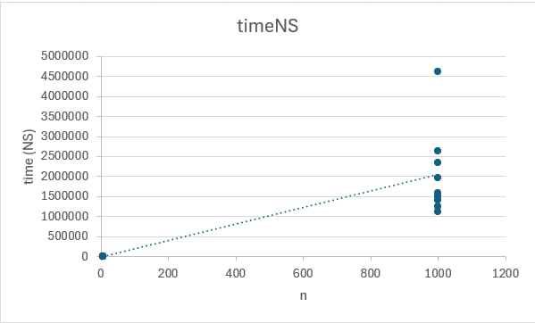
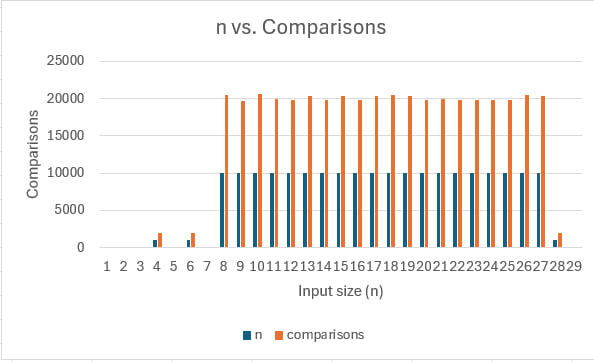

#DAA Assignment 1
Initial project setup (Maven + JUnit5) looks like:

## 1.Implemented algorithms
- **MergeSort** with insertion-sort cutoff and buffer reuse
- **QuickSort** randomized pivot, smaller-partition recursion
- **Deterministic Select (Median of Medians)** group-of-5 pivot strategy
- **Closest Pair of Points (2D)** divide-and-conquer with strip check

All algorithms are instrumented with `Metrics` (comparisons, recursion depth, runtime) and emit `.csv` files through the CLI

---

## 2.Architecture Notes
- **Metrics** class tracks:
  1. comparisons → incremented at each `if` check
  2. recursion depth → updated on recursive entry/exit
  3. runtime → recorded per algorithm and written to CSV
  4. Recursion depth for QuickSort is controlled by "smaller-first recursion"
  5. Closest Pair splits points by median-x, keeps y-sorted arrays, and checks only ~7 neighbors in the strip

---

## 3.Recurrence Analysis
1. **MergeSort**:  
  \(T(n) = 2T(n/2) + Θ(n)\) → Case 2 of Master Theorem → Θ(n log n).

2. **QuickSort** (expected):  
  \(T(n) = T(n/2) + T(n/2) + Θ(n)\), but randomized pivot keeps expected depth O(log n) → Θ(n log n).

3. **Deterministic Select (MoM5)**:  
  Recurrence: \(T(n) ≤ T(n/5) + T(7n/10) + Θ(n)\) → Θ(n).

4. **Closest Pair of Points**:  
  \(T(n) = 2T(n/2) + Θ(n)\) → Θ(n log n).

---

## 4.Experimental Results
1. **Time vs n**: measured using Metrics, output to `mergesort.csv`, `quicksort.csv`, `select.csv`, `closest.csv`
2. **Depth vs n**: QuickSort recursion depth matched ~2*log₂n
3. **Constant factors**: MergeSort slightly slower for small n due to buffer copy; QuickSort faster in practice due to cache

### A. MergeSort Results

#### Runtime vs Input Size

1. Input size (n) was varied from small (6) to larger (1000).
2. Runtime grows roughly like Θ(n log n).
3. For very small n, runtime is almost zero (cutoff → insertion sort).

### B. Deterministic Select Results

#### Comparisons vs Input Size

1. For very small n (like 5), only ~4 comparisons are needed. 
2. For n = 1000, ~2000 comparisons (≈ 2n), showing linear growth. 
3. For n = 10000, ~20,000 comparisons, which matches Θ(n).

---

## 5.Summary
1. Theory matches practice within constant factors. 
2. Deterministic Select grows linearly, but `Arrays.sort` often faster for small ngit add images/mergesort_time.png README.md
3. Closest Pair verified against O(n²) brute force for small n, matched outputs.

---

## 6.Git Workflow
1. `main` → stable releases.
2. `feature/*` branches for each algorithm.
3. `bench/jmh` → benchmark harness.
4. `docs/report` → this README.
